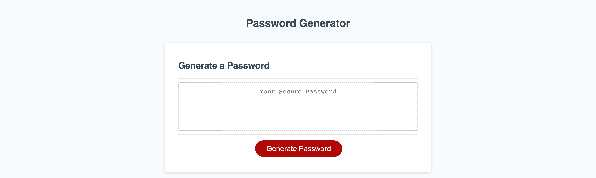

# Password Generator

## Description

Provide a short description explaining the what, why, and how of your project. Use the following questions as a guide:

-Created a password generator using a series of arrays and functions with if statements
-Used a for loop to generate the random password based off user built array (prompts)
-Display the randomly generated password to user

## Installation

N/A

## Usage

To use webpage, simply click generate and answer the prompts that follow, the password will be randomly generated based off of the parameters you set in the prompts

## Credits

-Dylan Stoudt
-uPenn

## License

MIT license provided in repo

---

🏆 The previous sections are the bare minimum, and your project will ultimately determine the content of this document. You might also want to consider adding the following sections.

## Badges

Badges aren't necessary, but they demonstrate street cred. Badges let other developers know that you know what you're doing. Check out the badges hosted by [shields.io](https://shields.io/). You may not understand what they all represent now, but you will in time.

## Features

If your project has a lot of features, list them here.

## How to Contribute

If you created an application or package and would like other developers to contribute to it, you can include guidelines for how to do so. The [Contributor Covenant](https://www.contributor-covenant.org/) is an industry standard, but you can always write your own if you'd prefer.

## Tests

Go the extra mile and write tests for your application. Then provide examples on how to run them here.

## Screenshot and link to deployed application
https://dylanstoudt.github.io/password-generator

